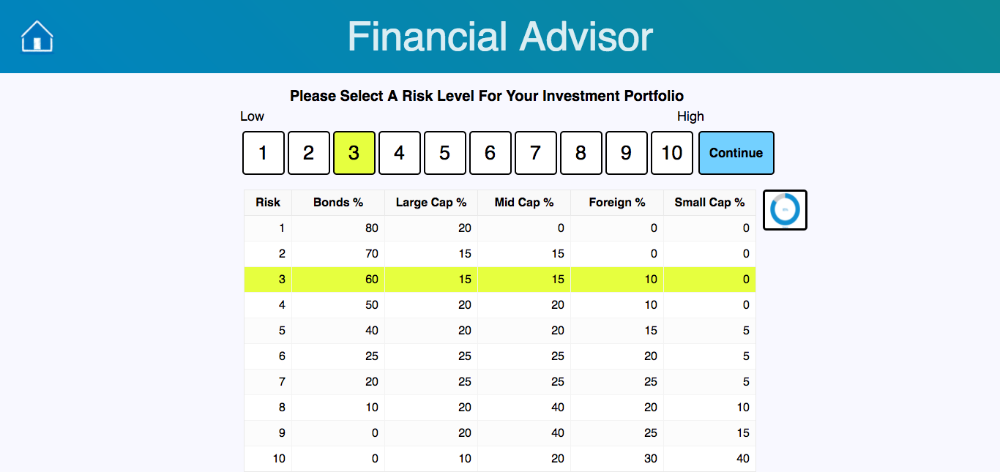
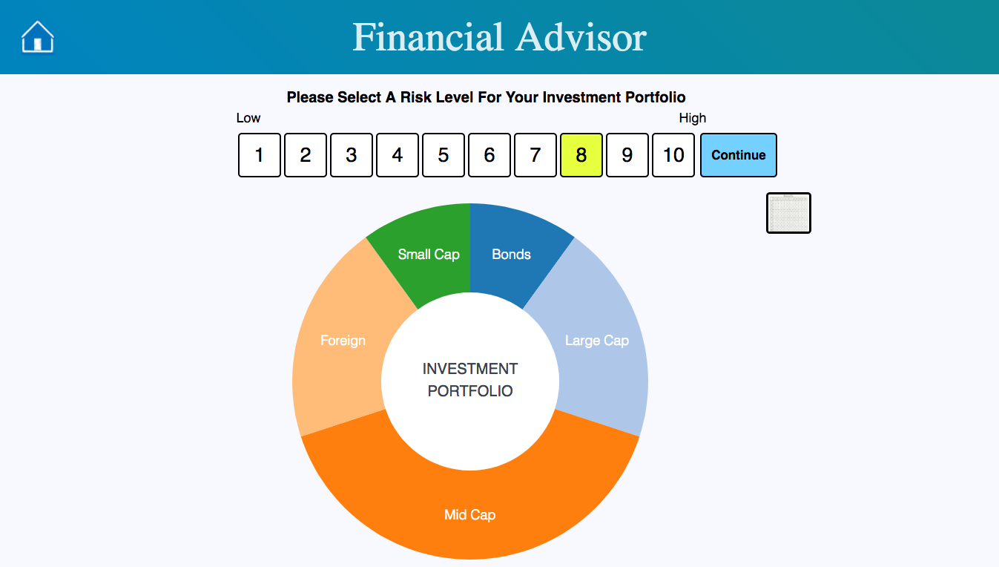

# Financial Advisor

[Link to Financial Advisor](http://financial-advisor-beta.surge.sh/)

This application helps users select their investment portfolio strategy. The user selects a risk level for their portfolio, and the application shows the user how the portfolio will look on a table or donut chart. After selecting a risk level and clicking "Continue", the user is prompted to enter the amount of money they currently have invested in each investment category. Then, clicking on "Rebalance" will reallocate the user's current investment to a new portfolio matching the risk level selected. The user will also be provided with a recommendation regarding how to make the minimal number of transfers to achieve the new portfolio balance.

Financial Advisor was developed using React/Redux, JS, jQuery, D3, and HTML/CSS.

Enjoy!

## Views

