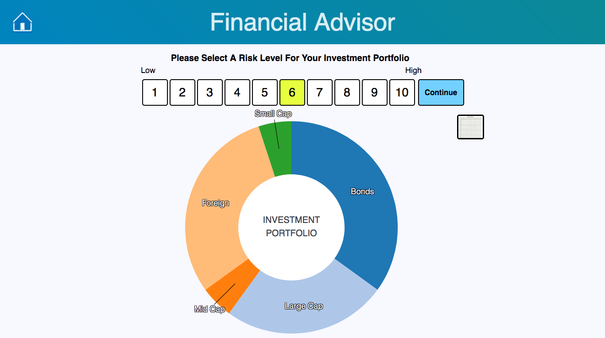
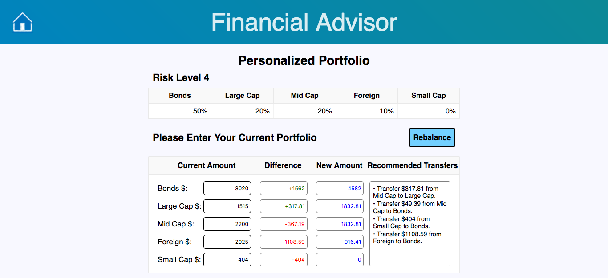

# Financial Advisor

[Link to Financial Advisor](http://financial-advisor-beta.surge.sh/)

This application helps users select their investment portfolio strategy. The user selects a risk level they are comfortable with, and the application helps to show them how their portfolio will look. After selecting a risk level, and clicking "Continue", the user is prompted to enter the amount of money they currently have invested in each investment category. Then, clicking on "Rebalance" will reallocate the user's current investment to a portfolio matching the risk level selected. The user will also be provided with recommended how to make minimal transfers to achieve the new portfolio.

Financial Advisor was developed using React/Redux, JS, jQuery, D3, and HTML/CSS.

Enjoy!

## Views

